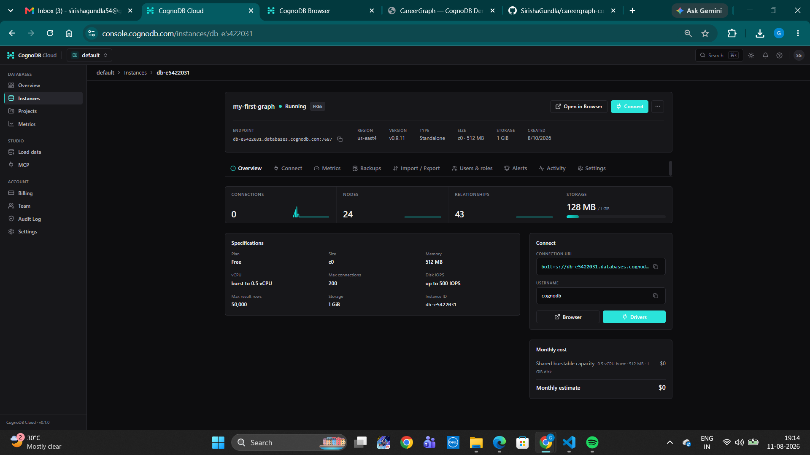

# CareerGraph – CognoDB

CareerGraph is a graph-powered career discovery application built with Flask, Python, Cypher, and CognoDB.

The application connects candidates, skills, jobs, companies, and domains to provide skill-based job recommendations, shared-skill discovery, and skill-gap analysis.

---

## 1. Use Case

CareerGraph addresses a real-world career discovery problem.

A candidate has a set of skills. Jobs require different skills, belong to companies, and are associated with domains. Instead of treating these as isolated records, CareerGraph models their relationships as a graph.

The main end-to-end flow is:

```text
Candidate
    ↓
HAS_SKILL
    ↓
Skill
    ↑
REQUIRES_SKILL
    ↑
Job
    ↓
AT_COMPANY
    ↓
Company
    ↓
IN_DOMAIN
    ↓
Domain
```

A candidate can therefore discover relevant jobs through shared skills and understand which skills are missing for a target job.

---

# 2. Why a Graph Database?

Career discovery is primarily a relationship problem.

The important questions are about connections:

- Which jobs match a candidate's skills?
- Which skills are shared between a candidate and a job?
- Which skills are missing for a particular job?
- Which companies offer jobs related to a candidate's skills?
- Which candidates are connected to jobs in a particular domain?

A relational database can represent this information, but these questions require multiple joins across candidates, skills, jobs, companies, and domains.

A graph database represents these relationships directly:

```text
Candidate
    │
    │ HAS_SKILL
    ▼
  Skill
    ▲
    │ REQUIRES_SKILL
    │
   Job
   ├──────────────► Company
   │                  │
   │                  │
   └──────────────► Domain
```

This makes multi-hop relationship traversal natural and keeps the application's core logic centered on the connections between entities.

---

# 3. Graph Data Model

## Nodes

The application uses the following labeled nodes:

```text
Candidate
Skill
Job
Company
Domain
```

## Relationships

```text
(Candidate)-[:HAS_SKILL]->(Skill)

(Job)-[:REQUIRES_SKILL]->(Skill)

(Job)-[:AT_COMPANY]->(Company)

(Job)-[:IN_DOMAIN]->(Domain)
```

## Complete Graph

```text
                         ┌─────────────┐
                         │   Company   │
                         └──────▲──────┘
                                │
                           AT_COMPANY
                                │
                                │
┌─────────────┐            ┌────┴─────┐
│  Candidate  │            │   Job    │
└──────┬──────┘            └────┬─────┘
       │                        │
   HAS_SKILL              REQUIRES_SKILL
       │                        │
       ▼                        ▼
   ┌───────┐               ┌─────────┐
   │ Skill │◄──────────────│  Skill  │
   └───────┘               └─────────┘
                                │
                            IN_DOMAIN
                                │
                                ▼
                          ┌──────────┐
                          │  Domain  │
                          └──────────┘
```

---

# 4. Data and Seed

The repository contains a seed script that creates realistic application data and the graph relationships required by the application.

The seed data contains:

- Candidates
- Skills
- Jobs
- Companies
- Domains
- Candidate-to-skill relationships
- Job-to-skill relationships
- Job-to-company relationships
- Job-to-domain relationships

The seed script is included in the repository so another developer can recreate the graph.

Run:

```bash
python seed.py
```

---

# 5. Main Graph Queries

## 5.1 Multi-Hop Recommendation

The primary graph traversal is:

```text
Candidate
    ↓ HAS_SKILL
Skill
    ↑ REQUIRES_SKILL
Job
    ↓ AT_COMPANY
Company
    ↓ IN_DOMAIN
Domain
```

Cypher:

```cypher
MATCH (c:Candidate {id: $candidateId})-[:HAS_SKILL]->(s:Skill)
      <-[:REQUIRES_SKILL]-(j:Job)-[:AT_COMPANY]->(co:Company)
      -[:IN_DOMAIN]->(d:Domain)
RETURN c.name,
       j.title,
       co.name,
       d.name,
       collect(DISTINCT s.name) AS matchedSkills
ORDER BY size(matchedSkills) DESC;
```

This is a multi-hop traversal because it crosses several relationships to connect a candidate to a job, company, and domain through shared skills.

---

## 5.2 Skill Gap Analysis

The application finds skills required by a job that the candidate does not have.

Graph:

```text
Candidate
    │
    └── HAS_SKILL ──► Existing Skills


Job
    │
    └── REQUIRES_SKILL ──► Required Skills
                                │
                                ▼
                         Missing Skills
```

Cypher:

```cypher
MATCH (c:Candidate {id: $candidateId})
MATCH (j:Job {id: $jobId})-[:REQUIRES_SKILL]->(s:Skill)
WHERE NOT (c)-[:HAS_SKILL]->(s)
RETURN j.title,
       collect(s.name) AS missingSkills;
```

This provides a practical explanation of what the candidate needs to learn or improve for a particular job.

---

## 5.3 Jobs Sharing Skills with a Candidate

Graph:

```text
             ┌───────────┐
             │ Candidate │
             └─────┬─────┘
                   │
               HAS_SKILL
                   │
                   ▼
                ┌───────┐
                │ Skill │
                └───┬───┘
                    ▲
                    │
             REQUIRES_SKILL
                    │
                    ▼
                 ┌─────┐
                 │ Job │
                 └─────┘
```

Cypher:

```cypher
MATCH (c:Candidate {id: $candidateId})-[:HAS_SKILL]->(s:Skill)
      <-[:REQUIRES_SKILL]-(j:Job)
RETURN j.title,
       collect(DISTINCT s.name) AS sharedSkills
ORDER BY size(sharedSkills) DESC;
```

This identifies jobs that have the greatest overlap with a candidate's existing skills.

---

## 5.4 Domain-Based Candidate Discovery

Graph:

```text
Candidate
    ↓
  Skill
    ↑
   Job
    ↓
 Domain
```

Cypher:

```cypher
MATCH (c:Candidate)-[:HAS_SKILL]->(s:Skill)
      <-[:REQUIRES_SKILL]-(j:Job)-[:IN_DOMAIN]->(d:Domain)
WHERE d.name = $domain
RETURN c.name,
       collect(DISTINCT s.name) AS relevantSkills,
       count(DISTINCT j) AS reachableJobs
ORDER BY reachableJobs DESC;
```

This query finds candidates connected to jobs in a selected domain through relevant skills.

---

# 6. Why the Domain Query Is Awkward in a Relational Schema

One of the graph-specific queries is:

```text
Candidate
    ↓ HAS_SKILL
Skill
    ↑ REQUIRES_SKILL
Job
    ↓ IN_DOMAIN
Domain
```

The query needs to traverse several relationships and aggregate the connected jobs and relevant skills.

In a relational schema, this would require multiple joins between candidate, candidate-skill, skill, job-skill, job, and domain tables.

In a graph, the relationships are represented directly and the traversal can be expressed naturally using Cypher.

---

# 7. Parameterised Queries

The application uses parameterised Cypher queries through the official Neo4j Python driver.

Examples:

```python
run_query(query, {"candidate_id": candidate_id})
```

and:

```python
run_query(query, {
    "candidate_id": candidate_id,
    "job_id": job_id
})
```

User input is therefore passed as query parameters rather than being concatenated directly into Cypher.

---

# 8. Application and UI/UX

CareerGraph is designed so that a non-technical user can explore the career discovery use case.

The application provides:

- Candidate selection
- Candidate skill information
- Job recommendations
- Match information
- Skill-gap analysis
- Job search
- Company information
- Domain information
- Graph-based traversal

## Loading State

The application should provide feedback while graph queries are running.

Example:

```text
Loading recommendations...
```

## Empty State

When a candidate has no connected jobs:

```text
No connected jobs found for this candidate.
```

The UI should explain what the user can do next rather than leaving a blank screen.

## Error State

When CognoDB cannot be reached:

```text
Unable to load recommendations.
Please check your database connection and try again.
```

The application also exposes a health endpoint for connection checking.

---

# 9. Application Architecture

```text
┌─────────────────────────────┐
│        Browser / UI         │
│      HTML + CSS + JS        │
└──────────────┬──────────────┘
               │ HTTP / JSON
               ▼
┌─────────────────────────────┐
│          Flask App          │
│                             │
│   Routes + API + Errors     │
└──────────────┬──────────────┘
               │
          Cypher / Bolt
               │
               ▼
┌─────────────────────────────┐
│          CognoDB            │
│                             │
│ Candidate / Skill / Job     │
│ Company / Domain            │
│ Relationships               │
└─────────────────────────────┘
```

Seed process:

```text
seed.py
   │
   │ Cypher
   ▼
CognoDB
   │
   ▼
Flask Application
   │
   ▼
Web Browser
```

---

# 10. Technology Stack

```text
Backend       → Python + Flask
Database      → CognoDB
Query         → openCypher / Cypher
Driver        → Official Neo4j Python Driver
Frontend      → HTML + CSS + JavaScript
Configuration → Environment Variables
Version       → Git + GitHub
```

---

# 11. Project Structure

```text
careergraph-cognodb/
│
├── app.py
├── seed.py
├── queries.cypher
├── requirements.txt
├── Procfile
├── README.md
├── .gitignore
├── .env.example
│
├── templates/
│   └── index.html
│
├── static/
│   ├── app.js
│   └── style.css
│
└── screenshots/
    ├── dashboard-connected.png
    ├── cognodb-graph.png
    └── error-state.png
```

---

# 12. CognoDB Cloud Setup

The assignment uses CognoDB as the graph database layer.

## Create an Account

Go to:

```text
https://console.cognodb.com/signup
```

The assignment states that the free tier does not require a credit card.

## Create a Free Instance

Create a free `c0` instance from the CognoDB Cloud console and choose a region.

## Connection Details

CognoDB provides a connection URI similar to:

```text
bolt+s://<instance-id>.databases.cognodb.cloud
```

The generated database user is:

```text
cognodb
```

The generated password should be stored securely because the assignment states that the password is shown exactly once.

## Driver

The application uses the official Neo4j Python driver because CognoDB speaks openCypher over Bolt and supports the official Neo4j drivers.

---

# 13. Environment Configuration

Create a `.env` file in the project root:

```env
COGNODB_URI=bolt+s://<instance-id>.databases.cognodb.cloud
COGNODB_USER=cognodb
COGNODB_PASSWORD=your_password
PORT=5000
```

The connection URI and password must never be committed to GitHub.

Use `.env.example` for placeholders:

```env
COGNODB_URI=your_cognodb_uri
COGNODB_USER=cognodb
COGNODB_PASSWORD=your_password
PORT=5000
```

---

# 14. Local Setup

## Clone

```bash
git clone YOUR_GITHUB_URL
cd careergraph-cognodb
```

## Create Virtual Environment

Windows:

```powershell
python -m venv .venv
```

Activate:

```powershell
.\.venv\Scripts\Activate.ps1
```

or Command Prompt:

```cmd
.venv\Scripts\activate
```

## Install Dependencies

```bash
pip install -r requirements.txt
```

## Configure Environment

Create `.env` with the CognoDB credentials.

## Seed Database

```bash
python seed.py
```

## Run Application

```bash
python app.py
```

Open:

```text
http://127.0.0.1:5000
```

Health check:

```text
http://127.0.0.1:5000/api/health
```

---

# 15. API Endpoints

| Endpoint | Purpose |
|---|---|
| `/` | Main CareerGraph web application |
| `/api/health` | CognoDB connection health check |
| `/api/candidates` | Retrieve candidates |
| `/api/jobs` | Retrieve/search jobs |
| `/api/recommendations/<candidate_id>` | Retrieve job recommendations |
| `/api/skill-gaps/<candidate_id>/<job_id>` | Retrieve missing skills |
| `/api/stats` | Retrieve graph statistics |

---

# 16. Screenshots


.png>)
.png>)

---

# 17. Hosted Demo

https://careergraph-cognodb-mxg4.onrender.com

---
## 18. Screen Recording

[Watch the CareerGraph CognoDB Screen Recording](./cognoDB.mp4)
<video controls src="cognoDB.mp4" title="Title"></video>
[Watch the CareerGraph CognoDB Screen Recording](./cognoDB.mp4)

---


---

# 19. Git Commands

```bash
git init
git branch -M main
git remote add origin YOUR_GITHUB_REPOSITORY_URL
git add .
git commit -m "Complete CareerGraph CognoDB application"
git push -u origin main
```

For future changes:

```bash
git add .
git commit -m "Update CareerGraph application"
git push
```

Before pushing, verify that `.env` is not included:

```bash
git status
```

---

# 21. Security

Never commit:

```text
.env
.venv/
__pycache__/
*.pyc
```

# 22. Assignment Alignment

CareerGraph addresses the assignment requirements through:

```text
Real-world use case
        ↓
Thoughtful graph data model
        ↓
Realistic seed data
        ↓
Multi-hop Cypher traversal
        ↓
Relationally awkward relationship query
        ↓
Parameterised Neo4j driver queries
        ↓
Functional web application
        ↓
Loading / empty / error states
        ↓
Environment-based credentials
        ↓
Clear project structure
        ↓
README + screenshots
        ↓
Hosted demo
        ↓
Screen recording
```

The application demonstrates how graph data modeling can be used to solve a relationship-heavy career discovery problem.
